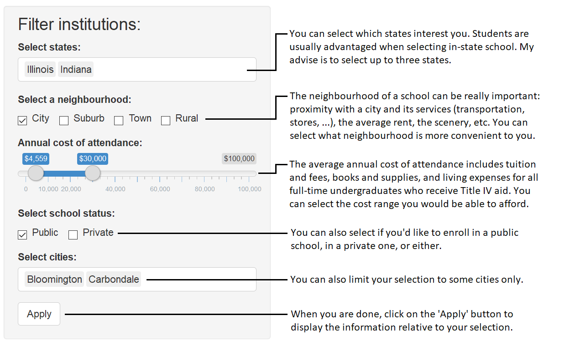
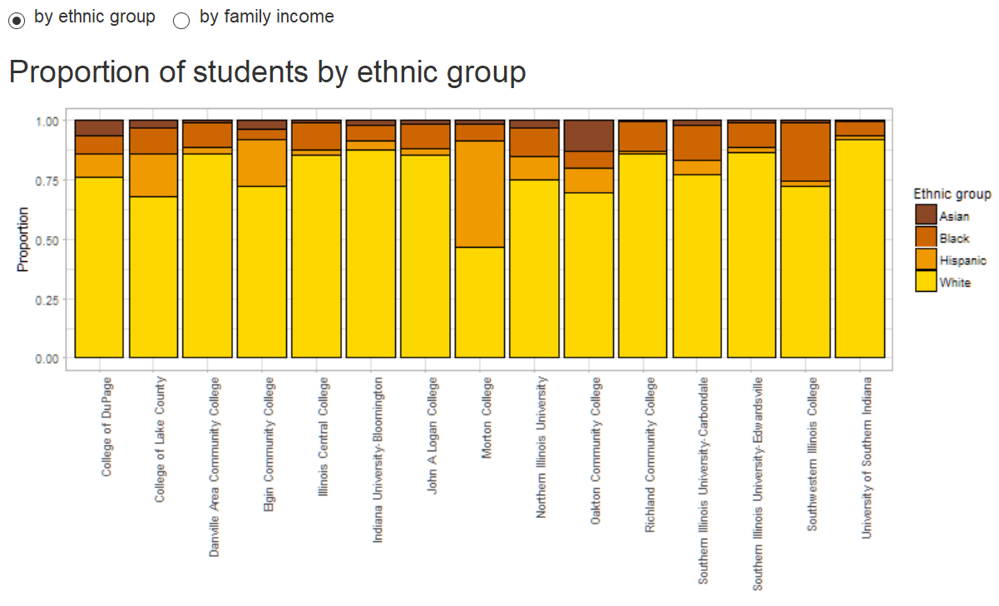
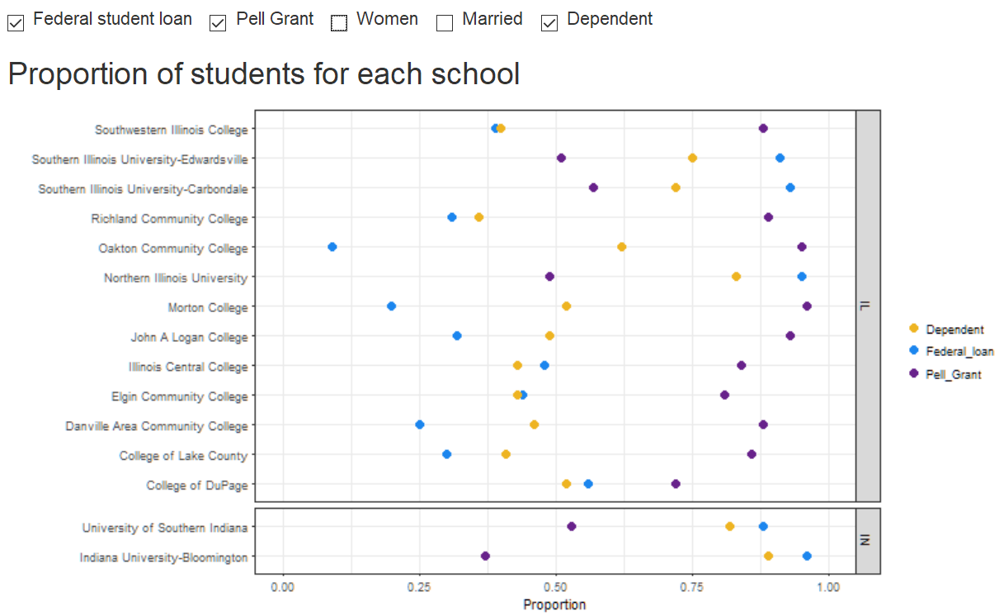
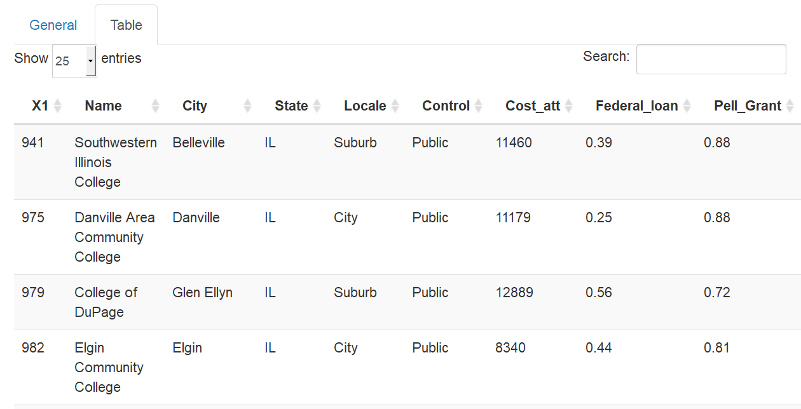

# The American Institutions App

Maud Boucherit, Jan 2018   

URL: https://maudboucherit.shinyapps.io/american_institutions/

This app is displaying information about American Institutions.

## The schools selection

The visualizations are readable for up to 20 schools.    

## The general panel

### The bar plot

This plot displays the proportion of students per ethnic group or per income group, per school.   

For this plot, you can choose which variable to display, the ethnic distribution or the income distribution.

### The proportion plot

This plot displays the proportion of students for several variables, per school.   

For this plot, you can choose which variables to display:
- the proportion of students with a federal student loan,
- the proportion of students with a Pell Grant,
- the proportion of female students,
- the proportion of married students,
- the proportion of dependent students.

## The table panel

You can change panel by clicking on the table window at the top.   

This panel displays all information about your school selection in raw data. You can arrange the schools by each variable, or search for a school in particular.

## Code

You can view the code [here](app.R).
