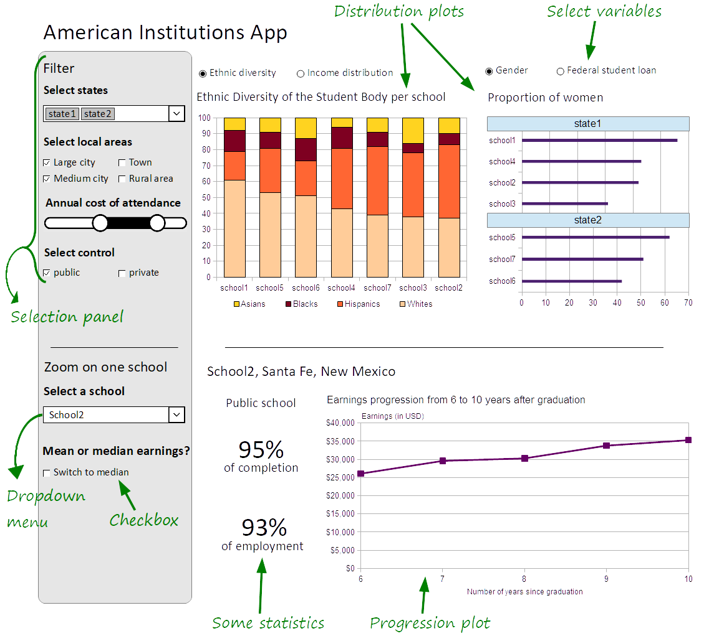

# American Institutions App
A Shiny app that displays information about American institutions.

Maud Boucherit   
Jan 2018   

## Overview

When applying for post-secondary education, one first needs to select some school of interest. But the United States provides plenty universities and colleges. So American students can feel lost. How can they choose among all these choices? To help students make this important decision, I propose building a data visualization app that allows them to compare institutions all over the United States. They can put in relation tuition costs and future earning records. They can find records of past federal financial aid. They can also explore some demographic information about the student body, like the proportion of students by ethnicity, by gender, or even the average entry age.

### Data

I am using the [scorecard](data/scorecard.txt) dataset.   
More information about this dataset is available [here](data/README.md).

## Usage scenario & tasks

Michael is 17 years old. He is currently attending high school in Santa Fe and wants to attend college next year. To choose which school matches his demands, Michael needs to [filter] institutions according to his criteria and then [compare] them on some variables of interest. He also wants to [discover] more precise information about this or that school in particular. By using the American Institutions App, Michael can specify information about his dreamed school like the state, the local area or the control of the institution (public/private). He can also select a range for the annual cost of attendance. He will then see an overview of general information about each school matching his selection. He can compare universities about their student bodies like the ethnic diversity and the proportion of undergraduates receiving a federal student loan.    
If Michael finds a school appealing, he can select it in the second section of the app to display new information. He can now see the completion and employment rates of this school, along with a progression plot showing the average earning of former students from 6 to 10 years after graduation. With the help of this app, Michael would be able to narrow down the number of schools matching his needs.

## Description of the app

The app shows the distribution (bar chart or density chart) of dataset factors like the ethnic diversity, the incomes distribution or the proportion of undergraduates receiving a federal student loan. Users can choose which variables they want to see. From a selection panel on the left side, users can filter institutions by state, by local area (i.e. only show schools from large cities), by control of the institution (i.e. if the school is public or private), and finally by the annual cost of attendance. A different drop-down menu will allow users to focus on one institution. The app will display new statistics about that school, along with a progression plot showing the average earning of former students from 6 to 10 years after graduation. The average earnings can be changed from mean to median by checking a box.   

